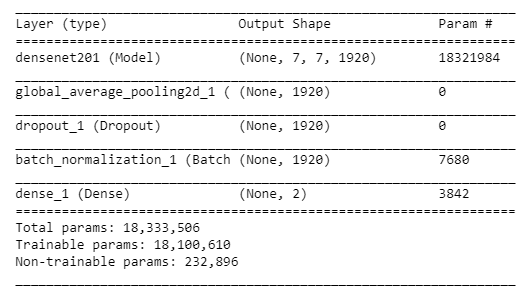
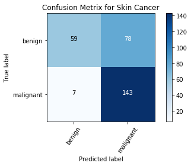
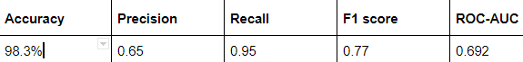

# Breast-cancer-classification

Breast Cancer Classification using CNN and transfer learning

## IMPORTANT

Absolutely, under NO circumstance, should one ever screen patients using computer vision software trained with this code (or any home made software for that matter). 

Check out the corresponding medium blog post [https://towardsdatascience.com/convolutional-neural-network-for-breast-cancer-classification-52f1213dcc9](https://towardsdatascience.com/convolutional-neural-network-for-breast-cancer-classification-52f1213dcc9).

## Data

The dataset can be downloaded from [here](https://web.inf.ufpr.br/vri/databases/breast-cancer-histopathological-database-breakhis/). This is a binary classification problem. I split the data as shown-

```
dataset train
  benign
   b1.jpg
   b2.jpg
   //
  malignant
   m1.jpg
   m2.jpg
   //  validation
   benign
    b1.jpg
    b2.jpg
    //
   malignant
    m1.jpg
    m2.jpg
    //...
```    

## Environment and tools

1. Jupyter Notebook
2. Numpy
3. Pandas
4. Scikit-image
5. Matplotlib
6. Scikit-learn
7. Keras

## Installation

`pip install numpy pandas scikit-image matplotlib scikit-learn keras`

`jupyter notebook`

## Model



## Results

### Loss/Accuracy vs Epoch


### Confusion Matrix



### ROC-AUC curve


### Correct/Incorrect classification samples




The model is able to reach a validation accuracy of 98.3%, precision 0.65, recall 0.95, f1 score of 0.77 and ROC-AUC as 0.692.

## References

1. https://peerj.com/articles/6201.pdf

2. https://arxiv.org/pdf/1811.04241

3. https://www.ncbi.nlm.nih.gov/pmc/articles/PMC6440620/


